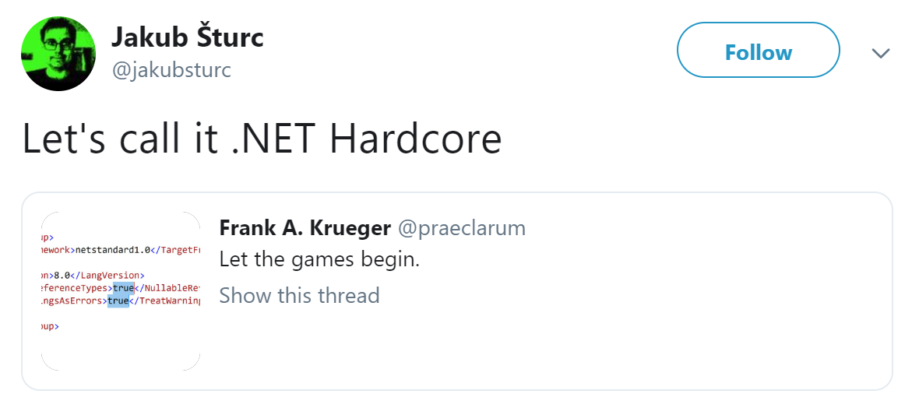

C# 8.0 will introduce a new groundbreaking feature called `Nullable reference types`, this feature will change the way we currently develop our software in C# by making, you guessed it, reference types nullable. 

This post serves as a practical introduction to the problem and how you should solve those problems.
<!--more-->

## Why should we use it?
There are multiple benefits in using this feature. The first and foremost is type safety for reference types. In the end it is very weird that we can assign a value to a reference type that is not of that type. For example: 

``` C#
string helloNull = null; 
```

Will cause a compiler butt kick! Because `null` is not a string! 

The second benefit is that it will make the `intent` of your code very clear. It tells you and the users of your solution how your code should be used and handled. In the blink of an eye you'll see what this code should do, and if your are doing it wrong the compiler will give you a kick in the butt.

The whole ecosystem including all the libraries that we all use will eventually be safer to use because they generate no null reference error and the intent of the libraries is much more clear!

*If you are still not convinved that null is a bad idea, then the creator of the `billion dollar mistake` also know as `null` has [publicly apolizeged for introducing it](https://en.wikipedia.org/wiki/Tony_Hoare#Apologies_and_retractions).* 


## Enabling
As this is a breaking change we need to enable it. Add the following to your `csproj` or maybe even better to your `Directory.build.props`:

``` XML
<LangVersion>8</LangVersion>
<TreatWarningsAsErrors>true</TreatWarningsAsErrors>
<NullableReferenceTypes>true</NullableReferenceTypes>
```

Also make sure your that all your also projects target *.NET Core 3.0 or higher.*

Welcome to **.NET Hardcore**




# Errors

When **.NET Hardcore** mode is on we will find lots of errors in our current codebase. We are only fixing the nullable references type which should be explicit. In the end it means when we fix these errors we will get to the real bugs, that only you can fix.


## Nullable parameters

When we give a method a nullable parameter often we mean that this parameter is optional. 

<script src="https://gist.github.com/MarcBruins/ff1c4f63f308ebfd018c0d5bde42e1b2.js"></script>

The error we would now run into is:

<span style="color:red">*CS8625 Cannot convert null literal to non-nullable reference or unconstrained type parameter.*</span> 

To fix this can make *Username* nullable by adding the <b>?</b>. Note that we also have to do this for the property.

<script src="https://gist.github.com/MarcBruins/f72b433ff97e8fd5129482c08f5d62a7.js"></script>


## Non-nullable properties that are uninitialized

When we create properties we often don't think about the consequences and if they should be nullable or not. For example we could have:

<script src="https://gist.github.com/MarcBruins/e63fe08f8ad70a496b10878782bb372f.js"></script>

Which is fine in the old world but it will now generate an error that you are almost definitely our going to encounter:

<span style="color:red">
<i>CS8618	Non-nullable property 'PropertyName' is uninitialized.</i><br/>
<i>CS8618 Non-nullable field 'FieldName' is uninitialized.</i>
</span> 

To fix these we should decide if this property should be nullable or not. If its nullable we append the <b>?</b> to it:

<script src="https://gist.github.com/MarcBruins/3647f7e98fa38a4ead3851a65c5db106.js"></script>

If it should not be nullable we need to set it! So either give a parameter that initiliazes it <b>or</b> set a default value:

<script src="https://gist.github.com/MarcBruins/2634de009457c302f6090f41eec8eeb6.js"></script>


## Returning null

Sometimes we tend to return null because we didn't do anything with the results:

<script src="https://gist.github.com/MarcBruins/06535a6d76d3253a0cb4a41bf9eced9f.js"></script>

The error we encounter is: 

<span style="color:red">*CS8603	Possible null reference return.*</span> 

You could argue that this might be a code smell but to fix it we should always return a initiliazed list or we should change the signature to make it return null:

<script src="https://gist.github.com/MarcBruins/b91a35f5bfe767aeba22c4243c790542.js"></script>


Another interresting case for this error might be that you are checking for null values, and if they are null, you are returning null as well:

<script src="https://gist.github.com/MarcBruins/cd7643d13f8a0c1bdb7f3587673938cd.js"></script>

To fix it, either decide to make your parameter nullable or to make it explicit:

<script src="https://gist.github.com/MarcBruins/208a523748c51d904cc95f19f16197a2.js"></script>


# Conclusion

While doing this work a lot of your codebase while change and errors will bubble up to the real problem you got to fix. This mostly means deciding if something should be null or not. When that is done your codebase quality is improved and the intent will be much clearer. 

Nullable reference types seem like a great way forward and i can't wait till everbody is using this feature to make our ecosystem so much better.


