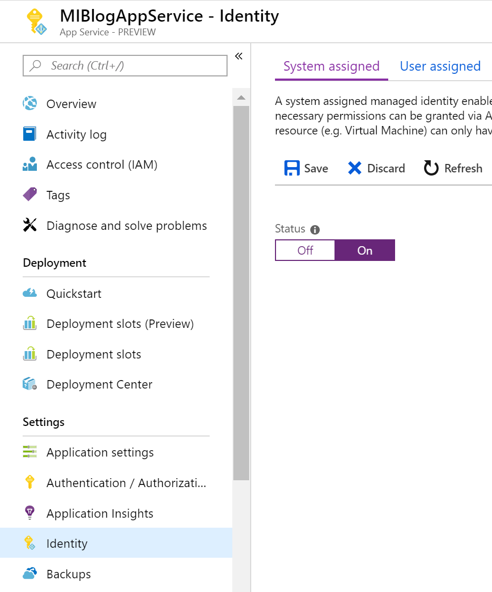
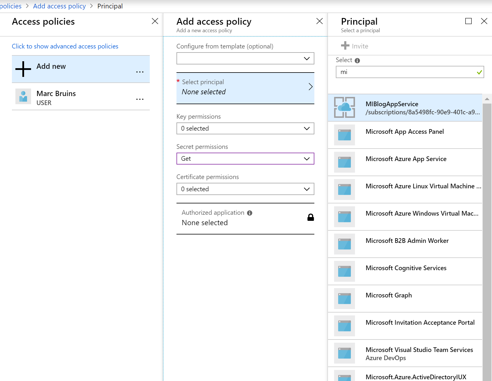
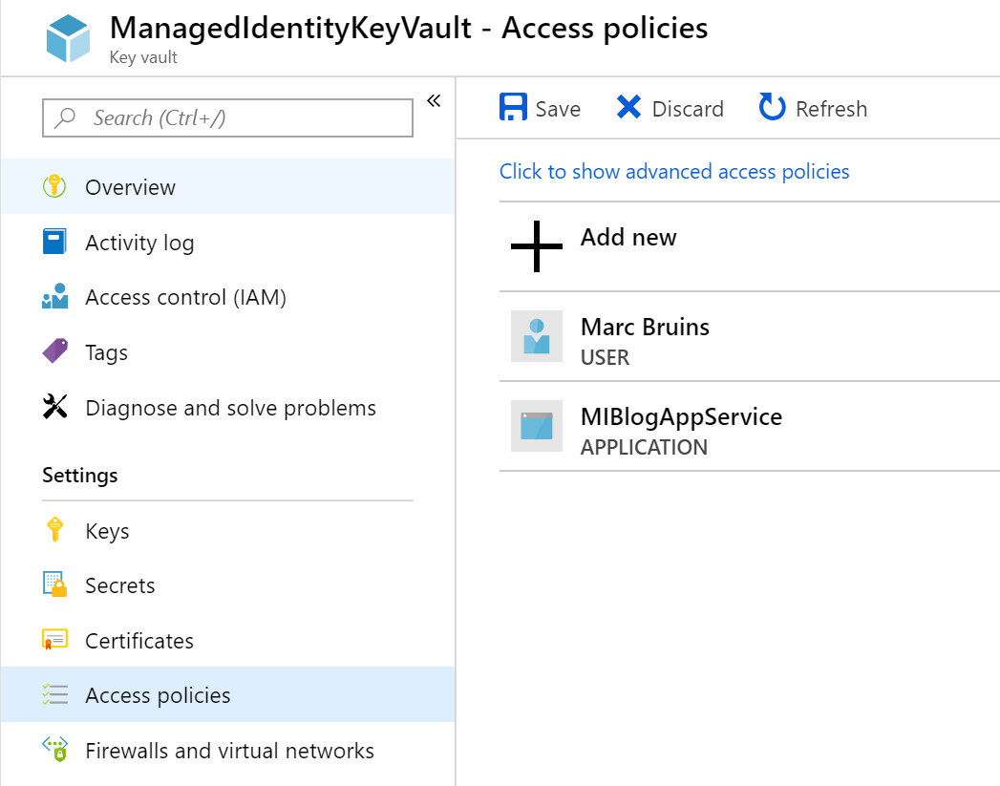
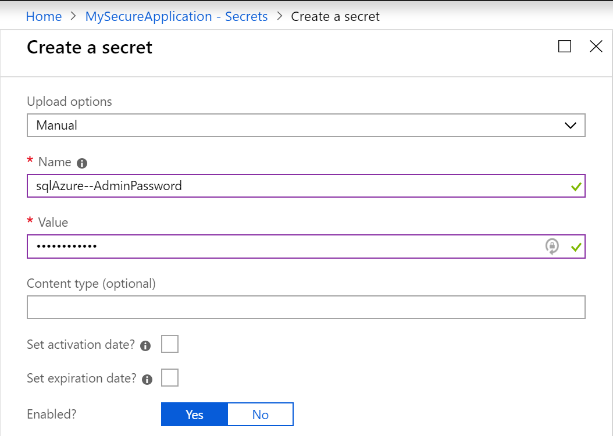
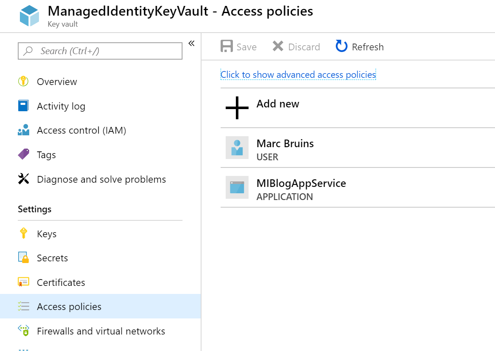

Imagine that your are building an application and you are using `Azure`. You are using one of these resources to develop your application in: **Azure VM's, Virtual Machine Scale Sets, Azure App Service or Azure Container Instances.**

You have some secrets in your application and you don't want to expose them in your source. One of the secrets you might for example have is a password for your database: 

Obviously we don't want this. This is a serious security risk which gives access to our database. To tackle this problem we are going to use [Azure key vault](https://docs.microsoft.com/en-us/azure/key-vault/key-vault-overview). It allows us to safely store and retrieve secrets at runtime. This way we have no more secrets lying around and we are safe again. 

<!--more-->

# Prerequisities
First of we need to setup a key vault and connect our Azure Resource to the key vault. Note that i'm not writing a full guide on how to setup key vault or any other Azure resources here, there are plenty of resources online that help you do that. We start with the managed identity for our existing resource and then we move on to the key vault.

## Enable Managed Identity
To give our application access rights to the key vault we are going to enable it to have a `managed identity`. A managed identity is a automatically created identity in `azure active directory`, we don't have to worry about active directory or creating an identity ourselves this is all done automatically, in other words, it's *managed*.

Managed identity exists for **Azure VM's, Virtual Machine Scale Sets, Azure App Service, Logic apps, Azure Data Factory V2, Azure API Management and Azure Container Instances.** It depends on your azure resource where this option lives in the azure portal, a quick search or a look inside you resource in the portal should give you a tab named `identity`.

Once you find it, you'll notice that there are two types of Managed identities: **System assigned identity and User assigned identity.**

## System assigned identity
This managed identity is assigned to the resource(system) itself. The identity is created when the Managed identiy feature is toggled and it dies when the resource that it is assigned to dies.

## User assigned identity
These are standalone resources. Therefore they do not rely upon the lifecycle of any other resource. **The benefit is that we can use the exact same user assigned identity across different resources.** 

## What is best?
That depends, you should choose what is best for you. If you have multiple VM's they would each fill in a slot when you choose a System assigned identity. The key vault allows 20 resources max, so for VM's it's better to choose a User assigned identity. 

If you only have one instance then easy and best solution would be a system assigned identity.

For our example we use a app service with a managed system assigned identity.

## Setup key vault
First decide what is the right approach for you. Maybe you want to create the key vault through the portal or another option might be that you use a ARM template to create it. Whatever you choose [the steps are documented.](https://docs.microsoft.com/en-us/azure/key-vault/) When you've done that, you should have a running key vault instance.

## Putting it all together
Now that we have our key vault instance running we can assign the correct access policies to our freshly created managed identity. 

To do this we navigate to our key vault and go to **access policies** and click **principal**. Search for your identity and select it. Give it `Get` permissions in the `Secret permissions` dropdown and finish the configuration by clicking **ok**.

After that we should see it appear in our access policies list.

Hit **save** to finish this step. Our application is now allowed to consume secrets given by the key vault!

# Creating a secret
Now that we have a running key vault let's create a secret, to do this we go to our keyvault and click on `Secrets`, next click `Generate/Import`. This should give us a screen in which we can create a *new secret*. We give this new secret a name that shows the purpose of it and we use a convention(`usedFor--Description` that shows it a keyvault secret. We call it **sqlAzure--AdminPassword** and set the value to a strong password, ideally a generated one, leave the optional fields as is and hit **Create**.

# Accessing our key vault
All the infrastructure is in place and we should be able to connect to the key vault. Install the following packages inside your application to communicatie with the keyvault:

<pre>
<b>
Install Package Microsoft.Azure.KeyVault 
Install Package Microsoft.Azure.Services.AppAuthentication
</b>
</pre>

Now let's see if we can get our secret out of the key vault, place the following code inside your application(for example in the startup of your application)

We would expect to see an error with the following message:

<i>
Exception Message: Access token could not be acquired. AADSTS700016: Application with identifier 'XXX' was not found in the directory 'XXX'. This can happen if the application has not been installed by the administrator of the tenant or consented to by any user in the tenant. You may have sent your authentication request to the wrong tenant
</i>

This message tells us that we still forgot a step. We've granted our application an identity that is allowed to communicate with the key vault but we are not that allowed application. We are developing **locally** and our machine isn't allowed to access the key vault! 

  <em><small>If it already works then it means your are logged in with the correct identity through the az-login command and that that identity has access policies in the keyvault. If you continue this way it means that every developer needs a identity with access policies to the key vault which could be a hassle. If you don't want that, and/or you want to know the alternatives read on..</small></em>

## Granting our local machine a trusted identity
In order to develop locally there is only one step that remains. We need to grant our local machine a identity that is trusted by the key vault. **There are two ways we can do this**. One is adding your own identity and log in locally with that identity. The other one is faking that you are the trusted application.

### Add your own identity and give it access policies
If your user is not added to the key vault then go ahead and do that. It works the same way as we have seen in *putting it all together* paragraph. It should look something like this:

Make sure you select that your user can *read secrets*. 

The second step is to verify, and if needed login with the right user locally. 

* To verify if you have the right account run `az account list`. Check the *isDefault* flag to see if your account is selected.
  
* If you are not logged in at all run `az login`
  
* If you don't have the right account selected run `az account set --s {subscriptionId}`

Run the code again and you should be able to access the secrets!

### Pretend that you are the trusted identity
The other option that we have it to fake that we are the trusted identity. To do that go to your `enviroment variables` and add the following to your `path`:

<em><small>AzureServicesAuthConnectionString is the key and the rest is the value</small></em>

You can find your AppId in the `identity` tab on your Azure Resource, you can see your `TenantId` when you run `az account list`. The AppKey is required if you have use it and you can find it in your `properties` tab on your azure resource.

Once set we can also get our secrets as if we where the application itself! 

The benefits of this approach are that you don't have to manage different user in your access policies. Another benefit is that if you run a container locally, you can use your host machine enviroment variable to connect to the key vault. Perfect in a containerizd world!

<em><small>If it doesn't work try rebooting, we've added a value to our path that might require a restart</small></em>

# Conclusion
Configuring key vault took us a bit of effort. We've added a managed identity, created a key vault and got the secrets out of the key vault. 

We've also seen the differences between a user assigned identity and a system assigned identity. Hopefully you also know now what to choose when.

Another decision that needs to be made is how to run your application locally. This again depends on your solution and what your application looks like. 

By completing these steps and talking about the different options we've succesfully created a secure enviroment in which our secrets can reside. There is no need for secrets in your source anymore!

